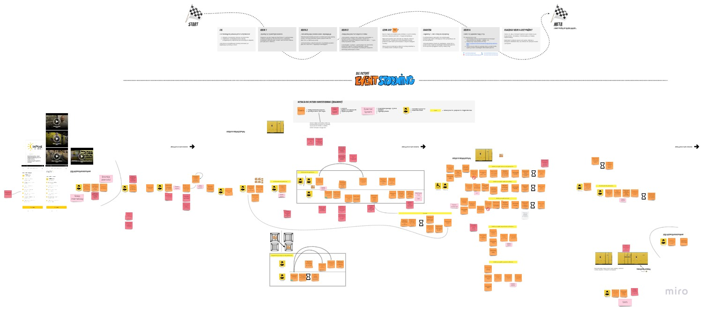

# Domain Explorers

# Spis treści

1. [O repozytorium](#o-repozytorium)
2. [Analiza domeny](#analiza-domeny)  
   2.1 [Big Picture EventStorming](#big-picture-eventstorming)  
   

## O repozytorium

Ten projekt stanowi zapis analizy, modelowania oraz implementacji w ramach [Domain Explorers](https://explorers.bettersoftwaredesign.pl). Znajdziesz tutaj zarówno artefakty wynikowe poszczególnych sesji EventStormingu, modelowania, jak i (docelowo) powstałą na tej bazie implementację.

## Analiza domeny : Paweł Kowalik i Stanisław Zajdel

Link do Miro: [Event Storming session](https://miro.com/app/board/o9J_lU57efw=/) 

